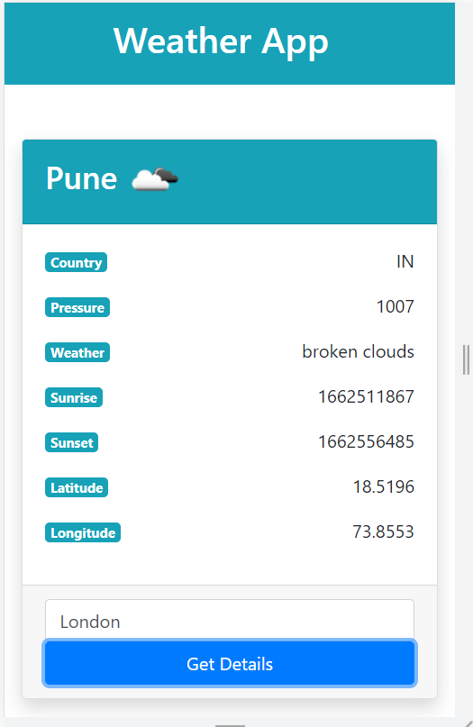

# Weather-app
* This repository contains weather application in Angular.
  * This projects revolves around the data we receive by hitting the end point of openweathermap.
  * The OpenWeatherMap is a service that provides weather data, including current weather data, forecasts, and historical data.
  * To use this current weather data API, one must need the API key, which you can get it from [here](https://openweathermap.org/).
  * This project uses Angular framework which is a component-based architecture to keep our code organized.
  ------------------
 
 ### Representation of the project
 

  ------------------
### Representation of the project

  ------------------
### Running Guide:
- Download the Repository
- Open the project in Visual Studio Code
- Type 'ng serve' in the terminal
- If you face any issues run npm rebuild node-sass
- npm install
  
